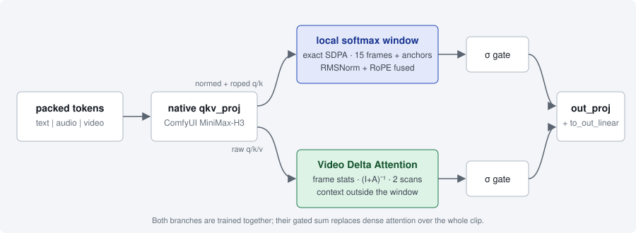

<div align="center">

# Kirei VDN-H3

**VideoDeltaNet for native ComfyUI MiniMax-H3.**
Exact OpenVDN math · optimized single-GPU runtime · measured, not promised.

[](LICENSE)
[](https://github.com/comfyanonymous/ComfyUI)
[](pyproject.toml)
[](tests)
[](https://github.com/OpenVDN/vdn-minimax-h3)



</div>

Kirei patches the MiniMax-H3 model that ComfyUI has already loaded. The native loader,
conditioning, audio/video packing, VAEs, quantized checkpoints and model lifecycle stay
untouched. On top of them Kirei adds what OpenVDN released: an exact local attention
window, the recurrent **Video Delta Attention** branch that carries context across the
whole clip, and the Stage-B / Stage-DMD adapters.

| | |
|---|---|
| **Faithful** | Window semantics, recurrence, gates, adapter placement and the AdaLN activation follow the OpenVDN reference. Adapters are never rounded into a quantized weight unless you ask for it. |
| **Built for one GPU** | Resident branch weights, calibrated exact attention per geometry, fused pointwise kernels, Triton temporal conv, model-owned compile caches, hybrid/streamed storage and exact tiling for 24 GB cards. |
| **Honest** | Every speed number lives in [`docs/PERFORMANCE.md`](docs/PERFORMANCE.md) with its hardware, recipe and date. The benchmark nodes refuse a measurement whose recipe does not match. |

> Model weights are not included. Follow the licenses of MiniMax-H3 and of the VDN-H3
> checkpoint you use.

---

## Install

**1. Clone the node.** No extra Python packages are required.

```bash
cd <ComfyUI>/custom_nodes
git clone https://github.com/hyukudan/ComfyUI-Kirei-VDN-H3.git
```

**2. Download a complete VDN stage** into `models/vdn`. Keep the OpenVDN directory
intact: Kirei validates the stage specification, branch inventory, block/head geometry and
adapter targets, and rejects an incomplete checkpoint instead of applying part of it.

```bash
# released 8-step model
hf download OpenVDN/vdn-minimax-h3 --include "stage-dmd-step-250/*" --local-dir <ComfyUI>/models/vdn
# optional 50-step fidelity reference
hf download OpenVDN/vdn-minimax-h3 --include "stage-b-step-2000/*"  --local-dir <ComfyUI>/models/vdn
```

Pruned/curve-form H3 bases also need `h3_silu_temb_grid.safetensors` to apply the
Stage-DMD AdaLN factors. Put one copy directly in `models/vdn` (preferred), or inside
the selected stage directory. Existing installations of `ComfyUI-MiniMax-H3-Turbo`
may already contain the same file; Kirei accepts that sibling location only as a legacy
fallback.

**3. Have the native MiniMax-H3 models** from
[Comfy-Org/MiniMax-H3](https://huggingface.co/Comfy-Org/MiniMax-H3):

| Model | File | Folder |
|---|---|---|
| Diffusion model | `minimax_h3_fl2va_int8_convrot.safetensors` (needs a torch **cu130+** build for the fast INT8 kernels) or the `fp8_scaled` variant | `models/diffusion_models` |
| Text encoder | `qwen3vl_32b_minimax_h3_nvfp4_awq.safetensors` | `models/text_encoders` |
| Video VAE | `minimax_h3_video_vae_fp16.safetensors` | `models/vae` |
| Audio VAE | `minimax_h3_audio_vae_fp32.safetensors` | `models/vae` |

A BF16 base works too if you have the VRAM for it; `auto` then folds the adapters into the
weights exactly and leaves no low-rank GEMMs in the hot path.

**Requirements.** A current ComfyUI with native MiniMax-H3 support, a CUDA build of
PyTorch, Triton (temporal kernel, FlexAttention, compiled fusions). Optional:
comfy-kitchen for INT8/NVFP4 bases; flash-attn 2 for the varlen decomposition (Ampere
and newer, sm_120 included when a wheel exists for your torch); **flash-attn-4**, the
CuTe DSL package (`pip install flash-attn-4`, or `"flash-attn-4[cu13]"` on CUDA 13),
which brings the tcgen05 kernel on B200, the wgmma kernel on Hopper and an mma.sync
kernel on sm_120 / Ada / Ampere. flash-attn-4 depends on `nvidia-cutlass-dsl`, which has
no Windows wheel: it cannot be installed on native Windows (do not force it with
`--no-deps`); use WSL2 or a Linux ComfyUI to try it. Flex on Windows needs
`triton-windows`.

---

## Use

Insert **Kirei Apply VDN-H3** right after the diffusion model loader, before the
MiniMax-H3 model-sampling node and the sampler.

```text
Load Diffusion Model ─▶ Kirei Apply VDN-H3 ─▶ MiniMax-H3 model sampling (video 12 / audio 3) ─▶ KSampler
```

Four settings matter. Everything else has a tooltip and a safe default.

| Input | Value | Why |
|---|---|---|
| `vdn_checkpoint` | `stage-dmd-step-250` | the released 8-step generator |
| `profile` | `auto` | quality-first policy, see below |
| `apply_turbo_adapter` | `true` | Stage-DMD needs **both** adapters at 1.0 |
| `strength` | `1.0` | the released recipe; the per-adapter strengths inherit it |

### Sampling recipe

The trajectory is part of the model. Use it exactly; `res_multistep`, extra steps or CFG
produce hard, patterned or oversharpened output even when the checkpoint is correct.

| | Stage-DMD (`stage-dmd-step-250`) | Stage-B (`stage-b-step-2000`) |
|---|---|---|
| Sampler / scheduler | `euler` / `simple` | `euler` / `simple` |
| Steps | **8** | **50** |
| Denoise / CFG | 1.0 / **1.0** | 1.0 / 1.0 |
| Shifts (video / audio) | 12 / 3 | 12 / 3 |
| Adapters | default 1.0 + turbo 1.0 | default 1.0, turbo **off** |
| Profile | `auto` | `reference` (numerical oracle) |

Use Stage-B first when a result looks wrong: if 50 steps are already off, the problem is
in the architecture, window semantics or AdaLN handling, not in the distillation adapter.

---

## What `auto` decides

`auto` is quality-first. It only takes a faster route when that route is exact, and it
reports every decision in the Runtime Report.

| Situation | Adapters | VDN projection | Branch storage | Local attention |
|---|---|---|---|---|
| BF16 base | merged (one fp32 delta, one rounding: exact) | BF16 | resident | calibrated exact winner |
| INT8 / FP8 / NVFP4 / MXFP8 base | exact activation-space bypass, `mlp.fc2` included | BF16 | resident | calibrated exact winner |
| Not enough headroom (total VRAM minus the base model) | bypass | may follow an INT8/FP8 base | hybrid or stream + 5-frame exact tiles | calibrated exact winner |
| Reference/keyframe rows make grouped attention copy too much | as above | as above | as above | calibrated exact winner when the peak fits; Flex without calibration on peak-memory risk |

Two rules behind the table. Merging an adapter into a quantized weight requantizes it and
rounds part of the update away, which is the softening people see with merged LoRAs on
INT8/FP8 bases, so `auto` never does it. And a quantized backbone does not mean the new
VDN projection should be quantized: on the workstation measurements INT8 did not beat
BF16, so quantized projections stay explicit experiments.

On full AdaLN bases, the modulation is activated from the fp32 time embedding, as
OpenVDN's patched diffusers does; ComfyUI otherwise rounds it to BF16 first. The
`adaln_fp32` patch is on by default. Curve-form pruned bases already evaluate their
AdaLN curve in fp32 without that SiLU patch, so their Runtime Report shows
`adaln_fp32 = false` and non-zero `curve_factors`.

### Profiles

| Profile | Use it for | What changes |
|---|---|---|
| `auto` | everything | the table above |
| `max_speed` | an explicit speed experiment | resident branch, adapters **merged** (requantized on quantized bases), quantized projection, CUDA graphs. Only faster if the benchmark and the quality gate say so. |
| `low_vram` | 24 GB cards | hybrid storage, 5-frame exact tiling, bypass adapters |
| `reference` | the numerical oracle | eager branch, grouped SDPA, BF16, no compile |
| `balanced`, `compat_reference`, `experimental_fp8`, `workstation_fp8` | experiments | manual placement, Comfy's attention override on the windows, FP8 projection, two-stream branch |

A profile name is not a benchmark result.

<details>
<summary><b>Advanced inputs</b> (collapsed in the node; every one has a tooltip)</summary>

| Input | Options | Notes |
|---|---|---|
| `default_adapter_strength`, `turbo_adapter_strength` | -1 … 2 | per-adapter strength; -1 inherits `strength` |
| `lora_mode` | auto, bypass, merge | auto merges on BF16 bases and bypasses on quantized ones; merging into a quantized base requantizes the weight |
| `branch_mode` | auto, resident, hybrid, stream | where the VDN branch lives; auto budgets total VRAM minus the base model |
| `attention_backend` | auto, grouped, flex, flash2, decomposed, reference, compat | exact local-window kernel; auto calibrates once per geometry and persists; compat goes through ComfyUI's attention override and is approximate |
| `projection_precision` | auto, bf16, int8, fp8 | precision of the VDN `to_out_linear` GEMM; int8 / fp8 are quality-gated experiments |
| `kernel_backend` | auto, triton, conv1d, eager | temporal-conv and activation kernels of the linear branch |
| `compile_policy` | auto, off, shared, reduce_overhead, max_autotune | torch.compile policy for the fused bodies; reduce_overhead is CUDA graphs |
| `tile_frames` | 0 … 64 | 0 lets the profile choose; N runs the branch in exact N-frame tiles |
| `pin_strategy` | auto, comfy, all, none | pinned host memory for streamed branch weights |
| `branch_execution` | auto, serial, parallel | parallel is an experimental second CUDA stream, resident weights only |
| `adaln_fp32` | on / off | request fp32 AdaLN activation on full AdaLN bases; curve-form bases already use their fp32 curve path and do not install this patch |
| `strict_validation` | on / off | check every branch tensor against the loaded H3 geometry before applying |
| `diagnostics` | on / off | per-stage CUDA-event timings and memory in the Runtime Report |

Use `reference` instead of rebuilding the numerical oracle from these switches.

</details>

---

## Your GPU

**RTX PRO 6000 Blackwell / RTX 50xx (sm_120).** This family is not a B200: it has no
tcgen05 tensor-core path and 99 KB of shared memory, so the FA4 kernel OpenVDN measured
does not apply. flash-attn-4 does ship an sm_120 kernel, its SM80-class mma.sync design,
and `auto` treats it as one more exact candidate: the calibration benchmarks grouped
SDPA, Flex-Triton and the FA4 decomposition once per geometry, checks parity and
persists the winner in `models/vdn/vdn_h3_calibration.json`. Nothing is assumed to win
here until it does; the Runtime Report shows the generation as `fa4_kernel`. NVFP4 and
MXFP8 bases are recognised. The fast INT8 path of the ConvRot checkpoint needs a torch
cu130+ build; older builds run comfy-kitchen's slow fallback. ComfyUI's global
SageAttention switch does not touch the exact VDN windows unless you select
`attention_backend = compat`.

**Native Windows.** flash-attn-4 is not installable (no `nvidia-cutlass-dsl` wheel), so
the candidates are grouped SDPA, Flex through `triton-windows` and FA2 (`flash2`) when a
wheel for your torch/CUDA is installed. Flex validates H3's fused Q/K/V layouts and only
materialises an operand when safe indexing requires it; smaller layouts keep the zero-copy
path. The Runtime Report shows `fa4_available = false` next to `fa4_kernel`, the
generation the card would run.

If the same machine also runs other PyTorch Inductor/Triton workloads, give ComfyUI its
own compile caches in the launcher. Replace `<ComfyUI>` with the installation path:

```bat
set "TORCHINDUCTOR_CACHE_DIR=<ComfyUI>\user\.cache\torchinductor-comfyui"
set "TRITON_CACHE_DIR=<ComfyUI>\user\.cache\triton-comfyui"
```

Cache isolation prevents artifacts from unrelated Python runtimes being reused and makes
compilation reproducible.

**24 GB cards.** `auto` moves to hybrid or streamed branch storage and exact 5-frame tiles
when the budget requires it; `low_vram` forces that layout.

**H100 / H200 / B200.** The FA4 decomposition (wgmma / tcgen05 kernels) is tried first
when flash-attn-4 is installed; otherwise the same grouped/Flex calibration applies.

---

## When VDN pays off

VDN replaces dense attention over the whole clip with a local window plus a linear
branch. The saving grows with the sequence; on short low-resolution clips the branch and
the extra projection cost as much as the attention they replace.

| Geometry | Dense ÷ VDN FLOPs per block |
|---|---:|
| 608×352 · 121 f | 1.02× (break-even) |
| 960×544 · 121 f | 1.14× |
| 608×352 · 241 f | 1.21× |
| 1280×736 · 145 f | 1.38× |
| 1344×768 · 345 f | 2.53× (OpenVDN measured 2.65× on a B200) |

Where VDN wins, the time is in the block GEMMs and the local softmax; the linear branch
is 6-8 % of the block. The model, the measured table and the protocol are in
[`docs/PERFORMANCE.md`](docs/PERFORMANCE.md). If VDN is slower than the base at a geometry
where the model says it should win, it is a profiler result, not a property of VDN:
check cold vs warm, the attention backend, the projection precision and the branch
placement in the Runtime Report.

---

## Quality checklist

Connect **Kirei VDN-H3 Runtime Report** after the apply node (and its `after` input to
the sampler output for a post-render report) and confirm:

1. `euler` / `simple` / 8 steps / denoise 1.0 / CFG 1.0, shifts 12 / 3;
2. `adapters.active = [default, turbo]`, both strengths 1.0;
3. `adapters.lora_mode = bypass` on a quantized base; full AdaLN bases report
   `adaln_fp32 = true`, while curve-form bases report non-zero `curve_factors`;
4. `projection = bf16` before any INT8/FP8 experiment;
5. `attention_calibration` names an exact backend (grouped, flex, flash2, decomposed);
6. Stage-B / 50 with `reference` separates architecture problems from distillation ones.

H3 aligns the requested frame count to its temporal grid. That is not a quality failure.

---

## Troubleshooting

| Symptom | Likely cause | Fix |
|---|---|---|
| Hard, patterned or oversharpened frames | `res_multistep`, 4 steps on the 8-step checkpoint, or CFG > 1 | use the recipe above |
| Soft output on an INT8/FP8 base | adapters merged (`max_speed` or `lora_mode = merge`) | `auto` or `lora_mode = bypass` |
| Out of memory on the first run with reference images | grouped attention copies every global row into every window | update the node and check `attention_calibration.dispatch_reason`; current `auto` selects Flex before an unsafe peak-memory calibration, while `low_vram` also reduces model residency |
| Old attention winner after updating the node, torch or a backend | none: the calibration signature includes the node version, torch/CUDA/driver, Triton, flash-attn versions and the installed backends | a changed environment recalibrates by itself; delete `models/vdn/vdn_h3_calibration.json` to force it |
| INT8 base is slow | torch build older than cu130: comfy-kitchen falls back | install a cu130+ build or use the `fp8_scaled` base |
| Dropdown shows the placeholder instead of a checkpoint | the stage directory is not under `models/vdn` | move it there and refresh the node list |
| "VDN-H3 is already applied to this MODEL" | one model was patched twice | keep a single Apply node per model |
| Slower than base H3 at 608×352 · 121 f | expected near break-even | measure at 241 frames or 720p and compare warm medians |

---

## Nodes

| Node | Category | Purpose |
|---|---|---|
| **Kirei Apply VDN-H3** | `model_patches/video` | apply the VDN branch, adapters and runtime policy |
| Kirei VDN-H3 Runtime Report | `…/advanced` | resolved runtime as JSON: recipe, adapters, precision, attention, layout rows, memory |
| Kirei VDN-H3 Calibrate Attention | `…/advanced` | benchmark the exact attention backends for one geometry, verify parity, persist the winner |
| Kirei Release VDN-H3 Weights | `…/advanced` | free VDN caches and auxiliary weights |
| Kirei Benchmark Scenario / Sampling / Start / End | `…/benchmark` | recipe-locked benchmark protocol, see [`benchmarks/README.md`](benchmarks/README.md) |
| Kirei Apply VDN-H3 (Legacy) | `…/legacy` | compatibility with old saved workflows |

Lifecycle rules: the branch weights are ComfyUI additional models and follow its
offload and memory accounting; applying VDN twice to one MODEL is rejected, and so is a
collision with another attention patch (apply VDN first); **Kirei Release VDN-H3
Weights** frees the caches explicitly; the legacy node id keeps old workflows loading.

---

## Documentation

- [`docs/ARCHITECTURE.md`](docs/ARCHITECTURE.md): how the block, the branch, the attention dispatch, the adapters and the memory policy are implemented.
- [`docs/PERFORMANCE.md`](docs/PERFORMANCE.md): FLOP model, measured results, what `auto` does per card, protocol.
- [`docs/VALIDATION.md`](docs/VALIDATION.md): recipes, quality gates and the acceptance checklist.
- [`benchmarks/README.md`](benchmarks/README.md): scenarios, recorder and comparison tooling.
- [`CHANGELOG.md`](CHANGELOG.md).

Tests run on CPU without a GPU or ComfyUI: `python -m pytest -q`. The GPU probes run
with the Python that runs ComfyUI, from any directory:

```bash
python <ComfyUI>/custom_nodes/ComfyUI-Kirei-VDN-H3/tests/probe_optimized_cuda.py --device cuda:0 --json probe-core.json
python <ComfyUI>/custom_nodes/ComfyUI-Kirei-VDN-H3/tests/probe_domestic_cuda.py --device cuda:0 --json probe-domestic.json
python <ComfyUI>/custom_nodes/ComfyUI-Kirei-VDN-H3/tests/probe_flex_cuda.py
```

The core probe uses q/k/v with the strides of the real fused projection, runs the real
calibration into a scratch store and times grouped, Flex, FA2 and FA4. The Flex probe
pushes twelve packed lengths through one dynamic compiled call to prove it stays compiled
instead of falling back to eager attention.

## Status

0.3.0 is unreleased. The runtime is complete and covered by the CPU suite, CUDA backend
probes and a release-scale end-to-end validation. The measured hardware table is still
being filled with five-run warm medians and reviewed quality results. Candidates that
need a measured win **and** a passed quality gate before they enter `auto`: copy-free
grouped attention, SageAttention on the local windows, NVFP4 projection, CUDA graphs on
the branch, and a parity test against the OpenVDN reference implementation.

## Credits and license

VDN mathematics, the released checkpoints and the tuned inference design are the work of
**OpenVDN** ([vdn-minimax-h3](https://github.com/OpenVDN/vdn-minimax-h3),
[openvdn.github.io](https://openvdn.github.io/)). Kirei's contribution is the native
ComfyUI integration: model patching, exact attention dispatch, quantized-base
compatibility, memory lifecycle, profiling and workstation execution.

Code is licensed under [Apache-2.0](LICENSE); see [`THIRD_PARTY.md`](THIRD_PARTY.md) and
[`NOTICE`](NOTICE) for attribution. Model weights are distributed separately under their
own terms.
